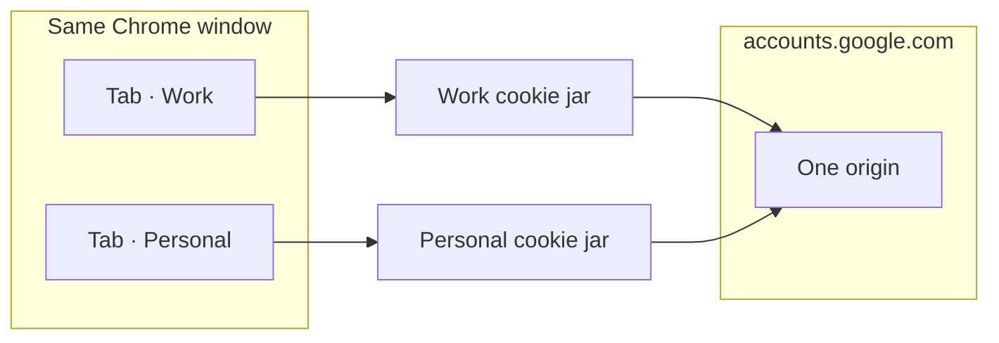

<p align="center">
  
</p>

<h1 align="center">Session Vault</h1>

<p align="center">
  <strong>One website. Separate logins.</strong><br>
  Keep personal, work, and client accounts apart in different Chrome tabs — without a second browser profile.
</p>

<p align="center">
  <a href="https://github.com/Mohpfd96/session-vault/actions/workflows/ci.yml"></a>
  
  
  
  
</p>

<p align="center">
  <a href="https://mohpfd96.github.io/session-vault/">Website</a>
  ·
  <a href="#install">Install</a>
  ·
  <a href="#status">Status</a>
  ·
  <a href="docs/architecture.md">Architecture</a>
  ·
  <a href="docs/privacy.md">Privacy</a>
  ·
  <a href="LICENSE">License</a>
</p>

---

Session Vault is a Chrome Manifest V3 extension for **login isolation**. Open the same site in two tabs, assign each tab a session, and keep those accounts from sharing cookies.

It is **not** Session Buddy. It does not save and restore piles of tabs.

It is **not** a separate Chrome profile. Isolation is a virtual layer inside the current profile: per-session cookie jars, declarativeNetRequest `Cookie` rewrite, and a MAIN-world `document.cookie` proxy. When isolation cannot be proven, the tab stays logged out rather than showing the wrong account.

**Current release: `0.1.0` (development).** Cookie isolation is implemented in the extension. Chromium Alice/Bob E2E tests, page-storage virtualization, and several product surfaces are not finished. Do not treat this build as V1-complete. See [Status](#status).

## Why

Chrome shares cookies across every tab of the same site. Two Gmail tabs are the same person. Incognito helps only until you need two logged-in accounts at once. Extra profiles work, but they duplicate extensions, bookmarks, and windows.

Session Vault gives you named sessions on the site you already have open:

- **Personal** and **Work** on the same Google account page
- A **client** login next to yours, on the same CRM
- A **temporary** session that disappears when its last tab closes

## How it works



For a bound tab, Session Vault:

1. Stores that session’s cookies in an IndexedDB jar on this device
2. Rewrites the request `Cookie` header for that tab only
3. Strips native `Set-Cookie` so Chrome’s shared jar does not mix accounts
4. Virtualizes `document.cookie` for page JavaScript

Page storage (`localStorage`, IndexedDB, Cache Storage, `BroadcastChannel`, Web Locks) is **specified** and **not yet virtualized**. Unbound, degraded, or unproven tabs get cookies **stripped**. Logged out is acceptable. The wrong login is not.

Read [docs/isolation-model.md](docs/isolation-model.md) and [docs/architecture.md](docs/architecture.md) for the contract and current coverage.

## Features (this build)

- **Per-site sessions** — create, rename, delete, and open isolated logins from the toolbar popup
- **Always a new tab** — creating or opening a session loads that site in a fresh tab after DNR is installed
- **Temporary sessions** — disposable jars, cleaned up when the last tab closes
- **Fail-closed** — never fall back to Chrome’s shared cookies for an isolated tab; DNR budget overflow strips cookies
- **Child-tab inheritance** — `openerTabId` binds new tabs to the parent session when the destination is in the same domain group
- **Local-first** — no account, no telemetry, no cloud sync
- **Honest limitations** — Service Workers, SharedWorker, and the HTTP cache are **not** isolated; the scanner that should name them is not shipped yet
- **Keyboard shortcuts** — `Alt+Shift+S` opens the switcher; `Alt+Shift+T` starts a temporary session

## Install

The Chrome Web Store listing is not published yet. Load an unpacked build:

```bash
git clone https://github.com/Mohpfd96/session-vault.git
cd session-vault
pnpm install
pnpm build
```

1. Open `chrome://extensions`
2. Turn on **Developer mode**
3. Click **Load unpacked**
4. Select `.output/chrome-mv3`

Reload the extension on that page after you pull changes.

Requires **Chrome 120+**.

## Usage

1. Open the site you want to isolate (for example `mail.google.com`)
2. Click the Session Vault icon
3. Create a session — a new tab of that site opens, logged out
4. Sign in as that account
5. Create another session for the next account

Click a session in the popup to open another tab of it. The toolbar icon fills when the current tab is in a session.

| Shortcut                | Action                                            |
| ----------------------- | ------------------------------------------------- |
| `Alt+Shift+S`           | Open the session switcher                         |
| `Alt+Shift+T`           | New temporary session                             |
| (Chrome shortcuts page) | Next / previous session, duplicate into a session |

## Privacy

Everything stays in this Chrome profile on this device.

| Data                               | Where                                                   |
| ---------------------------------- | ------------------------------------------------------- |
| Session names and metadata         | `chrome.storage.local`                                  |
| Which tab belongs to which session | `chrome.storage.session` (cleared when Chrome restarts) |
| Cookie jars                        | Extension IndexedDB                                     |

No analytics, no remote fonts in the extension, no upload unless you export a backup yourself. Backup **encryption primitives** exist; the import/export UI is not shipped. Public policy: [session-vault privacy](https://mohpfd96.github.io/session-vault/privacy.html). Details: [docs/privacy.md](docs/privacy.md) and [docs/permissions.md](docs/permissions.md).

## What it does not isolate

Say this out loud before you rely on it for high-assurance work:

- Existing **Service Workers** (Chrome applies them origin-wide; DNR does not see those responses)
- **SharedWorker**, the browser **HTTP cache**, history, bookmarks, and Chrome sync
- TLS client certificates, the password manager, FedCM, and some enterprise SSO
- Fingerprints, IP address, DNS, and HSTS
- **`localStorage` / IndexedDB / Cache Storage / BroadcastChannel / Web Locks** until Phase 3 lands

Session Vault is strong practical isolation for **HTTP cookies and `document.cookie`** when DNR rules are installed. It is not a second browser.

## Develop

```bash
pnpm install
pnpm dev          # unpacked ext with live reload
pnpm test:unit
pnpm compile
pnpm lint
pnpm format:check
pnpm build
```

|                 |                                 |
| --------------- | ------------------------------- |
| Stack           | WXT, React 19, Tailwind, Vitest |
| Package manager | pnpm                            |
| Output          | `.output/chrome-mv3`            |

Before a pull request: `pnpm compile && pnpm lint && pnpm format:check && pnpm test:unit`.

Playwright E2E (`pnpm test:e2e`) currently loads a smoke test only. Isolation proofs against Chromium are listed under [Phase 2](#phase-2--cookie-isolation).

## Status

Version **0.1.0**. Checklist below is based on the repository as of this writing, not on the original product brief. Items are **done** only when the code, tests, or UI for that item exist and match the intended behavior. Spec-only schemas, disabled switches, and stubs do **not** count as done.

Legend: **Done** · **Partial** · **Not started**

### Phase 1 — Foundation

**Status: Done**

The extension builds, lints, and unit-tests. Domain models, persistence, messaging, popup, side panel, and options exist.

| Item                                                        | State |
| ----------------------------------------------------------- | ----- |
| WXT + Chrome Manifest V3                                    | Done  |
| TypeScript (strict, including `exactOptionalPropertyTypes`) | Done  |
| ESLint + Prettier                                           | Done  |
| Vitest unit tests + GitHub Actions CI                       | Done  |
| Session domain model, lifecycle, branded IDs                | Done  |
| Schema v1, migrations, recovery lock                        | Done  |
| Typed messaging (UI / content / page) + Zod                 | Done  |
| Chrome API adapters                                         | Done  |
| Popup (current site, sessions, create / temp)               | Done  |
| Side panel (list, detail, domain detail, filters)           | Done  |
| Options / settings (theme, privacy copy)                    | Done  |
| IsolationProvider abstraction                               | Done  |
| Playwright harness (smoke only)                             | Done  |

### Phase 2 — Cookie isolation

**Status: Partial — implementation landed; Chromium proof has not**

Cookie isolation is **not** complete until the simultaneous same-origin Alice/Bob E2E test passes in Chromium.

| Item                                                       | State       |
| ---------------------------------------------------------- | ----------- |
| Managed domains + host permission request                  | Done        |
| Virtual cookie engine (parse, match, jar, header)          | Done        |
| Native cookie import into Default session                  | Done        |
| DNR compiler (priorities, path rules, fail-closed strip)   | Done        |
| RuleBudgetManager (degrade + strip, never native fallback) | Done        |
| Tab binding + `chrome.storage.session` recovery            | Done        |
| `webRequest` Set-Cookie ingest → jar → targeted rebuild    | Done        |
| MAIN-world `document.cookie` getter/setter                 | Done        |
| Safe `about:blank` then bind then navigate                 | Done        |
| Cookie / DNR / ingest / native-import unit tests           | Done        |
| Alice/Bob same-origin dual-session Playwright test         | Not started |
| HttpOnly / Path / redirect / parent-domain Chromium proofs | Not started |
| Service-worker kill + reload isolation proof               | Not started |

### Phase 3 — Web storage

**Status: Not started**

The messaging protocol reserves `content.storageOp`. The background router rejects it. The page runtime does not wrap storage APIs. IndexedDB has a `webStorage` object store that is unused.

| Item                                   | State       |
| -------------------------------------- | ----------- |
| `localStorage` namespace per session   | Not started |
| IndexedDB database-name virtualization | Not started |
| Cache Storage name virtualization      | Not started |
| `BroadcastChannel` name virtualization | Not started |
| Web Locks name virtualization          | Not started |
| Prefix-probe rejection                 | Not started |
| Storage unit + lab tests               | Not started |

`sessionStorage` is correctly **not** namespaced (tab-scoped browser default). That is intentional, not missing work.

### Phase 4 — Navigation and session UX

**Status: Partial**

| Item                                                    | State                     |
| ------------------------------------------------------- | ------------------------- |
| Child-tab inheritance via `openerTabId`                 | Done                      |
| Safe create-tab (`about:blank` → bind → navigate)       | Done                      |
| Popup: switch / open / create / temporary / delete      | Done                      |
| Duplicate page into another session                     | Done                      |
| Move current tab to a session                           | Done                      |
| Keyboard commands (switcher, temp, next, previous, dup) | Done                      |
| Per-site domain groups (registrable domain + matcher)   | Done                      |
| Custom multi-host domain families (Google-style SSO)    | Not started               |
| Context menu: Open / move / duplicate in session        | Not started               |
| Chrome Tab Groups integration                           | Not started               |
| Automatic URL routing rules                             | Not started               |
| Side-panel session settings (inherit / tab groups)      | Partial (shown, disabled) |

Context menu today: **Open side panel** on the toolbar icon only. There is no “Open link in Session” picker.

### Phase 5 — Lifecycle

**Status: Partial**

| Item                                                       | State       |
| ---------------------------------------------------------- | ----------- |
| Temporary sessions with last-tab cleanup                   | Done        |
| Delete session (unbind, drop jar, drop metadata)           | Done        |
| Browser-restart: tab IDs discarded, unassigned + strip     | Done        |
| MV3 worker init: restore bindings, drop stale, rebuild DNR | Done        |
| Archive / unarchive (domain transitions exist)             | Partial     |
| Convert temporary → persistent                             | Not started |
| Grace-period / browser-session temporary cleanup           | Not started |
| Clone session (cookies / storage / tabs / metadata)        | Not started |
| Selective clear (cookies, JS cookies, storage, site state) | Not started |
| Reset whole session without delete                         | Not started |

Archive is modeled and filtered in the side panel. There is no archive action in the UI.

### Phase 6 — Security and data

**Status: Partial**

| Item                                                           | State       |
| -------------------------------------------------------------- | ----------- |
| Structured logger with secret-key redaction                    | Done        |
| AES-GCM + PBKDF2 envelope (round-trip, wrong password, tamper) | Done        |
| Message validation (no page-supplied `sessionId`)              | Done        |
| Zod schemas for persisted records                              | Done        |
| Versioned backup envelope (types / docs)                       | Partial     |
| Import preview, collision policies, file I/O UI                | Not started |
| Encrypted `.sessionvault` export/import in the product         | Not started |
| Session Inspector / diagnostics                                | Not started |
| Privacy-safe activity timeline                                 | Not started |
| Redacted diagnostic export                                     | Not started |
| Masked cookie values in UI (Reveal / Copy)                     | Not started |

### Phase 7 — Compatibility

**Status: Not started**

`IsolationProvider.getCompatibility()` always returns `FULL` with no reasons. The side panel hard-codes a “full” line. Session `strictness` is stored but unused.

| Item                                            | State       |
| ----------------------------------------------- | ----------- |
| Detect controlling / registered Service Worker  | Not started |
| Detect SharedWorker                             | Not started |
| Per-origin FULL / LIMITED / UNSUPPORTED scoring | Not started |
| STRICT mode (block `register`)                  | Not started |
| CLEAN mode (user-confirmed origin wipe)         | Not started |
| Surface real limitation strings in UI           | Not started |

### Phase 8 — Product polish

**Status: Partial**

| Item                                                       | State       |
| ---------------------------------------------------------- | ----------- |
| Light / dark / system theme                                | Done        |
| Landing site (`site/`) + GitHub Pages                      | Done        |
| Architecture, threat, isolation, schema, privacy docs      | Done        |
| Keyboard list hook (exists, not wired into session lists)  | Partial     |
| Toolbar icon fill for bound tabs                           | Done        |
| Session-colored badge text (P / W / …)                     | Not started |
| WCAG pass (focus, contrast, reduced motion, SR status)     | Partial     |
| Performance budgets / profiling                            | Not started |
| Chrome Web Store listing, screenshots, privacy policy page | Partial     |
| Playwright E2E in CI                                       | Not started |
| Optional host permissions only (no install-time `*://*/*`) | Done        |

Host access is requested when you isolate a site. The packaged manifest does not declare install-time `*://*/*`. Store listing copy, 128px PNG icon, and the public privacy page are in [docs/chrome-web-store.md](docs/chrome-web-store.md). Screenshots still need to be captured from a loaded build.

### V1 acceptance criteria

V1 is **not** complete until every row is Done.

| #   | Criterion                                                   | State       |
| --- | ----------------------------------------------------------- | ----------- |
| 1   | Two tabs, same origin, different sessions, both open        | Partial     |
| 2   | Each can hold a different HttpOnly auth cookie              | Partial     |
| 3   | Refreshing either tab never changes the other’s login       | Not started |
| 4   | JavaScript `document.cookie` isolated                       | Done        |
| 5   | `localStorage` isolated                                     | Not started |
| 6   | IndexedDB isolated for supported sites                      | Not started |
| 7   | Cache Storage isolated for supported sites                  | Not started |
| 8   | Same-session tabs share cookie jar                          | Done        |
| 9   | Child tabs inherit the correct session                      | Done        |
| 10  | Survives MV3 service-worker suspension                      | Partial     |
| 11  | Temporary sessions remove state safely                      | Done        |
| 12  | DNR exhaustion fails closed                                 | Done        |
| 13  | Untrusted page cannot request another session’s secrets     | Done        |
| 14  | Sensitive values redacted from logs                         | Done        |
| 15  | Imported data validated                                     | Partial     |
| 16  | Backups can be encrypted                                    | Partial     |
| 17  | Service Worker limitations surfaced, not hidden             | Not started |
| 18  | Required permissions documented                             | Done        |
| 19  | Real Chromium E2E isolation tests                           | Not started |
| 20  | Zero tolerated cross-session leakage on supported scenarios | Not started |

Rows 1–3 and 19–20 stay **Partial / Not started** until Alice/Bob runs against Chromium. Cookie engines and DNR compilation are unit-tested; that is not a substitute.

### Out of scope (will not ship in V1)

Fingerprint spoofing, canvas/WebGL spoofing, residential proxies, CAPTCHA bypass, stealth automation, password manager, remote account sharing, cloud accounts, enterprise collaboration.

## Docs

|                                                                  |                                     |
| ---------------------------------------------------------------- | ----------------------------------- |
| [Architecture](docs/architecture.md)                             | Layers, DNR, fail-closed recovery   |
| [Isolation model](docs/isolation-model.md)                       | What is isolated vs what is not     |
| [Cookie engine](docs/cookie-engine.md)                           | Virtual jar behavior                |
| [Storage virtualization](docs/storage-virtualization.md)         | Page storage contract (not shipped) |
| [Permissions](docs/permissions.md)                               | Why each Chrome permission exists   |
| [Privacy](docs/privacy.md)                                       | Local-first data map                |
| [Chrome Web Store](docs/chrome-web-store.md)                     | Listing copy and upload checklist   |
| [Threat model](docs/threat-model.md)                             | Attacker goals and mitigations      |
| [Import / export](docs/import-export.md)                         | Backup envelopes                    |
| [Compatibility](docs/compatibility.md)                           | SW, SharedWorker, HTTP cache        |
| [Service Worker limitations](docs/service-worker-limitations.md) | Why DNR cannot see SW responses     |
| [Data schema](docs/data-schema.md)                               | Versioned records and stores        |
| [Recovery](docs/recovery.md)                                     | Worker kill, restart, budget        |
| [Testing](docs/testing.md)                                       | Unit and E2E strategy               |
| [Release checklist](docs/release-checklist.md)                   | Pre-ship gates                      |

## Website

The public landing page lives in [`site/`](site/) and deploys to [GitHub Pages](https://mohpfd96.github.io/session-vault/).

Enable it once under **Settings → Pages → Source: GitHub Actions**.

## License

Session Vault is dual-licensed.

**GPLv3** — personal use, study, modification, and open-source projects that stay under GPLv3 are free. See [LICENSE](LICENSE).

**Commercial** — closed-source or proprietary use, including organizational closed-source products, needs a separate license. [Get in touch](https://github.com/Mohpfd96).

© 2026 Mohamad Parsaeifard
