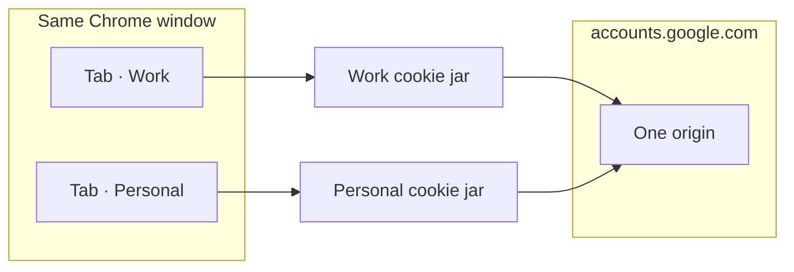

<p align="center">
  
</p>

<h1 align="center">Session Vault</h1>

<p align="center">
  <strong>One website. Separate logins.</strong><br>
  Keep personal, work, and client accounts apart in different Chrome tabs — without a second browser profile.
</p>

<p align="center">
  <a href="https://github.com/Mohpfd96/session-vault/actions/workflows/ci.yml"></a>
  
  
  
</p>

<p align="center">
  <a href="https://mohpfd96.github.io/session-vault/">Website</a>
  ·
  <a href="#install">Install</a>
  ·
  <a href="docs/architecture.md">Architecture</a>
  ·
  <a href="docs/privacy.md">Privacy</a>
  ·
  <a href="docs/isolation-model.md">Isolation model</a>
</p>

---

Session Vault is a Chrome extension for **login isolation**. Open Gmail as work in one tab and as yourself in another. Each session gets its own cookie jar. The address bar still shows the real site.

It is **not** Session Buddy. It does not save and restore piles of tabs. It keeps accounts from leaking into each other.

It is **not** a separate Chrome profile. Isolation is a virtual layer in your current profile. When isolation cannot be proven, the tab stays logged out rather than showing the wrong account.

## Why

Chrome shares cookies across every tab of the same site. Two Gmail tabs are the same person. Incognito helps only until you need two logged-in accounts at once. Extra profiles work, but they duplicate extensions, bookmarks, and windows.

Session Vault gives you named sessions on the site you already have open:

- **Personal** and **Work** on the same Google account page
- A **client** login next to yours, on the same CRM
- A **temporary** session that disappears when its last tab closes

## How it works



For a bound tab, Session Vault:

1. Stores that session’s cookies in an IndexedDB jar on this device
2. Rewrites the request `Cookie` header for that tab only
3. Strips native `Set-Cookie` so Chrome’s shared jar does not mix accounts
4. Namespaces page storage (`document.cookie`, `localStorage`, IndexedDB, Cache Storage, `BroadcastChannel`) per session

If a tab is unbound, degraded, or rules cannot be installed, cookies are **stripped**. Logged out is acceptable. The wrong login is not.

Read [docs/isolation-model.md](docs/isolation-model.md) and [docs/architecture.md](docs/architecture.md) for the full contract.

## Features

- **Per-site sessions** — create, rename, and open isolated logins from the toolbar popup
- **Always a new tab** — creating or opening a session loads that site in a fresh tab
- **Temporary sessions** — disposable jars, cleaned up when the last tab closes
- **Fail-closed** — never fall back to Chrome’s shared cookies for an isolated tab
- **Local-first** — no account, no telemetry, no cloud sync
- **Encrypted backups** — optional `.sessionvault` files with PBKDF2 + AES-GCM
- **Honest compatibility** — Service Workers, SharedWorker, and the HTTP cache are called out when they can weaken isolation
- **Keyboard shortcuts** — `Alt+Shift+S` opens the switcher; `Alt+Shift+T` starts a temporary session

## Install

The Chrome Web Store listing is not published yet. Load an unpacked build:

```bash
git clone https://github.com/Mohpfd96/session-vault.git
cd session-vault
pnpm install
pnpm build
```

1. Open `chrome://extensions`
2. Turn on **Developer mode**
3. Click **Load unpacked**
4. Select `.output/chrome-mv3`

Reload the extension on that page after you pull changes.

Requires **Chrome 120+**.

## Usage

1. Open the site you want to isolate (for example `mail.google.com`)
2. Click the Session Vault icon
3. Create a session — a new tab of that site opens, logged out
4. Sign in as that account
5. Create another session for the next account

Click a session in the popup to open another tab of it. The toolbar icon fills when the current tab is in a session.

| Shortcut                | Action                                            |
| ----------------------- | ------------------------------------------------- |
| `Alt+Shift+S`           | Open the session switcher                         |
| `Alt+Shift+T`           | New temporary session                             |
| (Chrome shortcuts page) | Next / previous session, duplicate into a session |

## Privacy

Everything stays in this Chrome profile on this device.

| Data                               | Where                                                   |
| ---------------------------------- | ------------------------------------------------------- |
| Session names and metadata         | `chrome.storage.local`                                  |
| Which tab belongs to which session | `chrome.storage.session` (cleared when Chrome restarts) |
| Cookie jars and virtual storage    | Extension IndexedDB                                     |

No analytics, no remote fonts in the extension, no upload unless you export a backup yourself. Details: [docs/privacy.md](docs/privacy.md) and [docs/permissions.md](docs/permissions.md).

## What it does not isolate

Say this out loud before you rely on it for high-assurance work:

- Existing **Service Workers** (Chrome applies them origin-wide; DNR does not see those responses)
- **SharedWorker**, the browser **HTTP cache**, history, bookmarks, and Chrome sync
- TLS client certificates, the password manager, FedCM, and some enterprise SSO
- Fingerprints, IP address, DNS, and HSTS

Session Vault is strong practical isolation for application cookies and page storage. It is not a second browser.

## Develop

```bash
pnpm install
pnpm dev          # unpacked ext with live reload
pnpm test:unit
pnpm compile
pnpm lint
pnpm format:check
pnpm build
```

|                 |                                 |
| --------------- | ------------------------------- |
| Stack           | WXT, React 19, Tailwind, Vitest |
| Package manager | pnpm                            |
| Output          | `.output/chrome-mv3`            |

Before a pull request: `pnpm compile && pnpm lint && pnpm format:check && pnpm test:unit`.

## Docs

|                                                |                                   |
| ---------------------------------------------- | --------------------------------- |
| [Architecture](docs/architecture.md)           | Layers, DNR, fail-closed recovery |
| [Isolation model](docs/isolation-model.md)     | What is isolated vs what is not   |
| [Cookie engine](docs/cookie-engine.md)         | Virtual jar behavior              |
| [Permissions](docs/permissions.md)             | Why each Chrome permission exists |
| [Privacy](docs/privacy.md)                     | Local-first data map              |
| [Threat model](docs/threat-model.md)           | Attacker goals and non-goals      |
| [Import / export](docs/import-export.md)       | Backup envelopes                  |
| [Compatibility](docs/compatibility.md)         | SW, SharedWorker, HTTP cache      |
| [Testing](docs/testing.md)                     | Unit and e2e notes                |
| [Release checklist](docs/release-checklist.md) | Pre-ship gates                    |

## Website

The public landing page lives in [`site/`](site/) and deploys to [GitHub Pages](https://mohpfd96.github.io/session-vault/).

Enable it once under **Settings → Pages → Source: GitHub Actions**.

## License

Source is public on GitHub. Add a license file if you want to define reuse terms.
