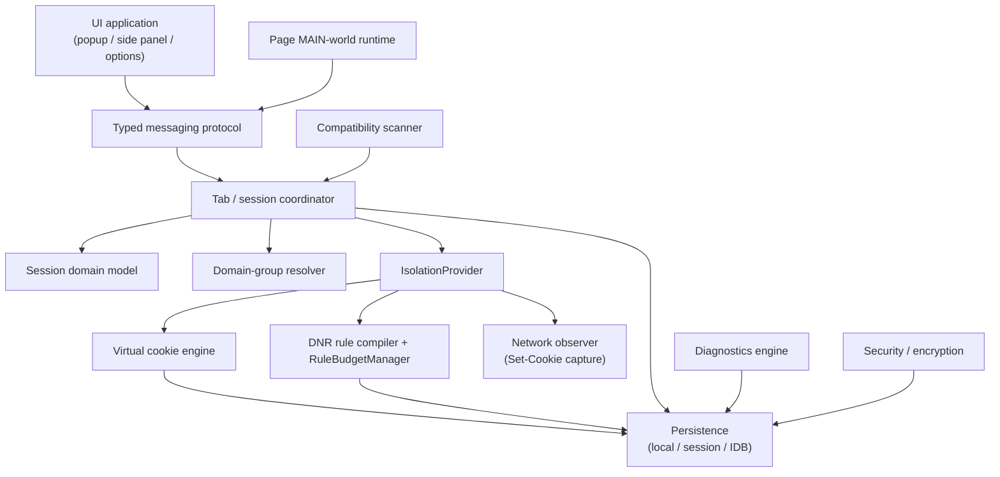
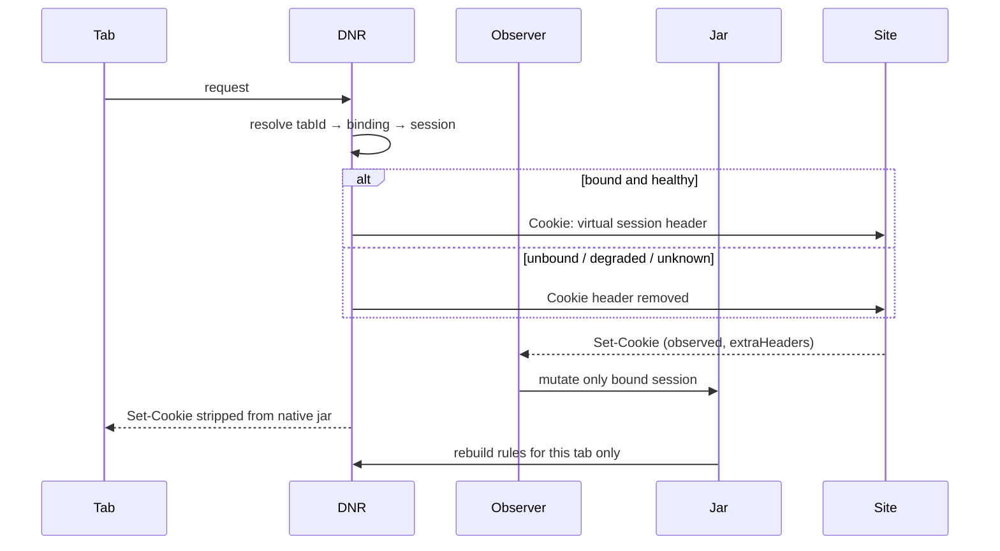

# Session Vault Architecture

Session Vault is a Chrome Manifest V3 extension that provides **practical application-session isolation**: multiple simultaneous logins to the same site in different tabs.

Chrome does not expose Firefox-style per-tab cookie stores. Session Vault therefore does **not** swap Chrome’s shared cookie jar. It implements a **virtual session isolation layer** and fails closed when isolation cannot be proven.

This is **not** equivalent to separate Chrome profiles. See [isolation-model.md](./isolation-model.md) and [threat-model.md](./threat-model.md).

Implementation status of each layer is tracked in the root [README](../README.md#status). This document is the architecture contract. Where code has not landed yet, the section says so.

## Product invariant

> Never allow credentials or site state from Session A to leak into Session B.

If isolation state is uncertain, the page must receive **no** authentication cookies rather than another session’s cookies. Cross-session leakage is a severity-0 defect.

## Architectural decision: virtual isolation

| Approach                                                                     | Verdict                                                                          |
| ---------------------------------------------------------------------------- | -------------------------------------------------------------------------------- |
| Continuously swap `chrome.cookies` for the active tab                        | Rejected. Race-prone, leaks on fast tab switches, cannot serve two tabs at once. |
| Native Chrome profiles via a companion app                                   | Future optional provider. Not required for V1.                                   |
| Virtual jars + DNR request `Cookie` rewrite + page-world storage namespacing | **V1 provider.** Cookie rewrite is shipped. Storage namespacing is not.          |

The V1 provider (`VirtualExtensionIsolationProvider`) owns:

- per-session HTTP cookie jars (IndexedDB) — **shipped**
- DNR session rules that `SET` the request `Cookie` header for bound tabs — **shipped**
- DNR session rules that `REMOVE` response `Set-Cookie` on managed tabs so the native jar is not the source of truth — **shipped**
- MAIN-world virtualization of `document.cookie` — **shipped**
- MAIN-world virtualization of `localStorage`, IndexedDB, Cache Storage, `BroadcastChannel`, and Web Locks — **specified, not shipped**
- tab ↔ session bindings recovered from `chrome.storage.session` — **shipped**

A future `NativeBrowserProfileIsolationProvider` may replace network and storage isolation with real Chromium profiles without changing the domain model or UI. It is not implemented.

## Chrome API facts this design depends on

Verified against Chrome MV3 documentation (Chrome 120+):

- `declarativeNetRequest.updateSessionRules` — session-scoped rules; cleared on browser shutdown and extension update. Limit: `MAX_NUMBER_OF_SESSION_RULES` = 5000. `modifyHeaders` rules also count toward `MAX_NUMBER_OF_UNSAFE_SESSION_RULES` = 5000.
- `HeaderOperation.SET` replaces an existing header. `SET` on request `Cookie` is the enforcement mechanism.
- `HeaderOperation.REMOVE` on request `Cookie` is the fail-closed mechanism.
- `HeaderOperation.REMOVE` on response `Set-Cookie` prevents native jar pollution for managed tabs.
- Rule `condition.tabIds` scopes rules to specific tabs.
- `urlFilter` / `requestDomains` provide host and path matching. Path-aware Cookie headers are compiled as separate rules when cookies use non-`/` paths.
- If a rule **removes** a header, lower-priority rules cannot modify it. Fail-closed `REMOVE Cookie` must outrank `SET Cookie`.
- `webRequest.onHeadersReceived` with `extraHeaders` can **observe** `Set-Cookie` (non-blocking in MV3). It cannot rewrite headers. DNR remains the enforcement layer.
- DNR does **not** apply to Service Worker–generated responses (`onfetch` / Cache Storage hits). This is a documented compatibility boundary.
- MV3 service workers can be killed at any time. `chrome.storage.session` and IndexedDB are the recovery sources. In-memory maps are never authoritative.

## Layer map



Chrome APIs live behind adapters in `modules/adapters/chrome`. Core cookie, domain, and session logic is pure TypeScript and unit-tested without Chrome.

Shipped today: UI, messaging, coordinator, domain model, domain groups, cookie engine, DNR compiler, Set-Cookie observer, persistence, page `document.cookie` runtime, encryption primitives, redacting logger.

Not shipped: compatibility scanner, diagnostics engine, routing engine, page-storage virtualization.

### Layer responsibilities

1. **Session domain model** — profiles, lifecycle states, cloning, temporary cleanup. No Chrome calls.
2. **Virtual cookie engine** — RFC-aware `Set-Cookie` parse, matching, overwrite, Cookie-header generation.
3. **DNR rule compiler** — deterministic, path-aware, budgeted compilation of session rules.
4. **Network observer** — captures `Set-Cookie` for the bound session only; triggers targeted rule rebuilds.
5. **Tab/session coordinator** — bindings, inheritance, restart reconciliation, fail-closed defaults.
6. **Domain-group resolver** — Public Suffix List via `tldts`; exact / registrable / subdomain / pattern matching.
7. **Page-storage virtualization runtime** — tiny framework-free MAIN-world script. Cookie proxy is live; other APIs are not wrapped yet.
8. **Persistence** — `chrome.storage.local` (metadata), `chrome.storage.session` (bindings), IndexedDB (jars).
9. **Messaging protocol** — discriminated unions, Zod at trust boundaries.
10. **Compatibility scanner** — Service Worker / SharedWorker / Cache Storage detection. Interface exists; always returns `FULL`.
11. **Diagnostics engine** — inspector + redacted timeline. Not implemented.
12. **Security/encryption** — WebCrypto AES-GCM backup envelope, log redaction. Product import/export UI is not implemented.
13. **UI application** — React; talks only to messaging facades.

## Isolation provider abstraction

```ts
interface IsolationProvider {
  readonly kind: 'virtual-extension' | 'native-profile';
  bindTab(input: BindTabInput): Promise<IsolationResult>;
  unbindTab(tabId: TabId): Promise<void>;
  navigateSafely(input: SafeNavigateInput): Promise<TabId>;
  rebuildRules(scope: RuleRebuildScope): Promise<IsolationResult>;
  getCompatibility(origin: Origin): Promise<CompatibilityReport>;
}
```

UI and domain code depend on this interface. They must not import DNR types. The native-profile kind is reserved; only `virtual-extension` is implemented.

## DNR rule priorities

Higher number wins in Chrome.

| Priority | Name                      | Action                                                                                                               |
| -------- | ------------------------- | -------------------------------------------------------------------------------------------------------------------- |
| 1000     | `FAIL_CLOSED_STRIP`       | `REMOVE` request `Cookie` when the tab is unbound, degraded, corrupted, or recovery is uncertain on a managed domain |
| 900      | `VIRTUAL_COOKIE_PATH`     | `SET` request `Cookie` for a specific path prefix (most specific first)                                              |
| 800      | `VIRTUAL_COOKIE_ROOT`     | `SET` request `Cookie` for the default `Path=/` case                                                                 |
| 700      | `NATIVE_SET_COOKIE_STRIP` | `REMOVE` response `Set-Cookie` on managed isolated tabs                                                              |
| 100      | `RESERVED`                | Future allow/deny                                                                                                    |

Compiler rules:

- One healthy bound tab with only `Path=/` cookies → one `SET` rule + one `Set-Cookie` strip.
- Mixed paths → additional `VIRTUAL_COOKIE_PATH` rules. Each `SET` value is the **full** Cookie header valid for that path, not a delta.
- Degraded / unknown → `FAIL_CLOSED_STRIP` only. Never fall back to native cookies.
- Rebuilds are scoped to affected tab IDs. Never rewrite the entire session ruleset for one cookie mutation unless the budget manager requires a compact rebuild.

## Network path



## Page runtime trust boundary

The MAIN-world script is untrusted from the extension’s perspective even though we inject it.

- It never receives other sessions’ data.
- It never accepts a `sessionId` from page JavaScript as authority.
- Background resolves session exclusively from `TabBinding` in `chrome.storage.session`.
- All page → content → background payloads are Zod-validated.
- HttpOnly cookies are never returned by `document.cookie`.
- A `content.storageOp` from the page is rejected until storage virtualization ships.

## Persistence split

| Store                    | Contents                                                           | Survives SW kill  | Survives browser restart |
| ------------------------ | ------------------------------------------------------------------ | ----------------- | ------------------------ |
| `chrome.storage.local`   | settings, session metadata, domain groups, routing, schema version | yes               | yes                      |
| `chrome.storage.session` | tab bindings, DNR rule id map, ephemeral recovery flags            | yes               | **no**                   |
| Extension IndexedDB      | cookie jars, virtual storage, snapshots, diagnostics index         | yes               | yes                      |
| DNR session rules        | active isolation enforcement                                       | no (must rebuild) | **no**                   |

Routing, virtual web storage, snapshots, and diagnostics stores are **reserved** in schema v1. Only cookie jars, sessions, domain groups, settings, and tab bindings are written today.

On every background init:

1. Load schema + settings.
2. Restore session bindings.
3. Query open tabs; drop bindings whose tab IDs no longer exist.
4. After browser restart, tab IDs are not identity. Unproven tabs on managed domains are **unassigned** and fail-closed until the user chooses a session.
5. Recompile DNR for remaining proven bindings.
6. Init is idempotent: repeated init must not duplicate rules.

## Directory architecture

```
.
├── docs/                          # product + security documentation
├── entrypoints/
│   ├── background/index.ts        # MV3 service worker
│   ├── popup/                     # toolbar popup (React)
│   ├── sidepanel/                 # main management UI (React)
│   ├── options/                   # settings + privacy page
│   ├── isolation.content.ts       # ISOLATED-world bridge
│   └── page-runtime.ts            # MAIN-world runtime (no React)
├── modules/
│   ├── domain/                    # SessionProfile, DomainGroup, lifecycle
│   ├── cookies/                   # parser, matcher, jar, header compiler
│   ├── dnr/                       # compiler, priorities, RuleBudgetManager
│   ├── tabs/                      # TabBinding, inheritance, reconciliation
│   ├── domains/                   # PSL-aware matching, managed domains
│   ├── persistence/               # local / session / idb / migrations
│   ├── messaging/                 # protocol + validation
│   ├── security/                  # encryption envelope, (redaction in logging)
│   ├── adapters/chrome/           # thin Chrome API wrappers
│   ├── isolation/                 # IsolationProvider implementations
│   ├── logging/                   # structured, redacting logger
│   └── errors/                    # typed domain errors
├── app/                           # UI use-cases (no Chrome APIs in views)
├── components/                    # React view components
├── lib/                           # cn(), shared helpers
├── tests/
│   ├── unit/
│   └── e2e/                       # Playwright smoke; Alice/Bob not landed
├── test-site/                     # local isolation lab (not shipped)
├── site/                          # public landing page
└── .github/workflows/
```

Planned modules not present yet: `modules/compatibility`, `modules/diagnostics`, `modules/routing`, `modules/network` (Set-Cookie observation lives in the background entrypoint + cookie ingest).

## UI surfaces

Session Vault is a _login isolation_ manager, not a tab collection manager.

- Instant search over sessions and domains.
- Compact color + icon + name + count rows.
- One-click primary actions; details live in the side panel.
- Light / dark / system. No remote fonts.

Popup: current site, isolation chip, session list, new persistent/temporary, open manager.

Side panel: Sessions list + Session detail + Domain detail. Cookie inspector, activity timeline, and live compatibility scoring are not shipped.

## Permissions

Required in this build: `tabs`, `activeTab`, `storage`, `scripting`, `declarativeNetRequestWithHostAccess`, `webRequest`, `webNavigation`, `contextMenus`, `sidePanel`, `cookies`. Host access is `optional_host_permissions` (`*://*/*` as the request ceiling) and is granted per site when the user isolates it.

Store listing privacy policy: [https://mohpfd96.github.io/session-vault/privacy.html](https://mohpfd96.github.io/session-vault/privacy.html). See [permissions.md](./permissions.md) and [chrome-web-store.md](./chrome-web-store.md).

## Explicit non-goals

No fingerprint spoofing, proxies, CAPTCHA bypass, password manager, cloud accounts, or anti-detect behavior.
